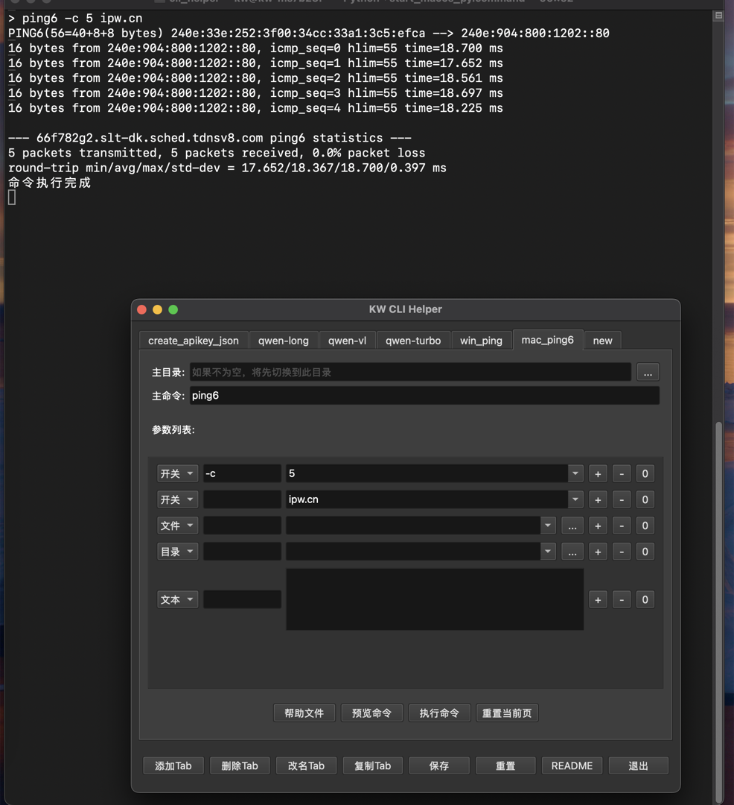
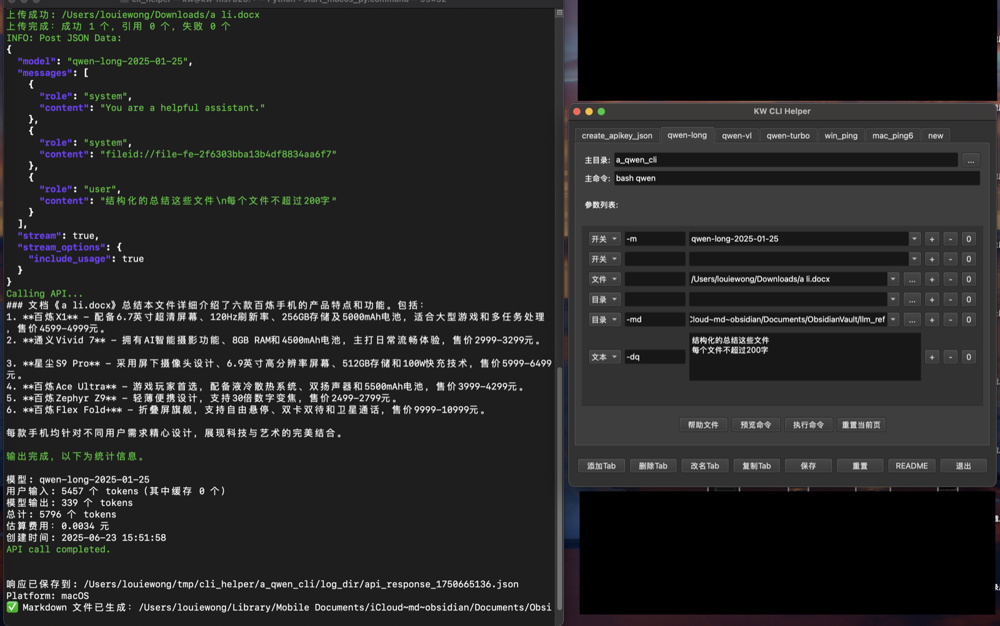

## 本项目是一个cli执行器，和一个qwenlong脚本。

### 代码由AI写成，我做了少量修改调试。仅供娱乐。
### USE AT YOUR OWN RISK

### 一、cli helper基于pyqt(pyside6)，通用命令执行工具。详细[说明见此](helper_gui/README.md)。

#### 可自由增减开关和参数，选择文件和目录，保存配置。
#### 多行文本会被转换为base64，为避免特殊字符断行，需在脚本中转换回来。
#### 单行文本会保留原样，用单引号包裹
#### cli helper的依赖：pyside6 markdown
#### 程序不带控制台，需要系统控制台直接显示输出
#### 故此要从start_win_exe.bat,start_macos_bin.command,start_linux_bin.sh启动

### 二、aqwencli是shell脚本，其[说明见此](a_qwen_cli/README.md)。

#### 主要功能包括qwenlong的文件上传（包括目录上传和cache机制），batch任务生成，输出到md；
#### qwenvl的图片上传（oss）和基本功能
#### 首次使用请从create_api_key页面生成apikey.json，或手动添加。
#### aqwencli的依赖：curl jq bash(coreutils)
#### 如果不想安装上面这些依赖，可以使用打包好的执行文件，windows版自带精简cygwin。
#### windows下的微软电脑管家，会导致脚本运行特别慢，务必关闭。

### 三、后记
    1. qwenlong作为千万上下文的大模型，其能量被低估了，以至于主流的客户端并不支持其独特的文件管理机制和不太一样的引用方式。
    2. qwenlong是支持读图的，尤其是图片中的文本理解，比qwenvl要强很多。
    3. 本来试图用tkinter，但是在跨平台的时候问题太多，不支持高分辨率和缩放，换用pyqt发现也很好用。（反正都是丢给ai改写：）
    4. pyside6跨平台真是牛，问题一下就都消失了，打包的文件大了10M，从tk的20M到pyqt的30M，可以接受。
    5. shell工具链在windows下最佳实现还是cygwin，但，但像date命令就完全不一样。msys2在一般脚本上的性能并不比cygwin强。
    6. claude-sonnet-4编程太强了，从整体框架到奇淫巧技，无不精通。deepseek和qwenmax半斤八两，前者可能略强。
    7. 如果ai写出来的不能用（往往是低级错误），可能出现1.0-2.0-3.0-1.0循环的情况，用多个大模型（或人工介入）才能继续改进。
    8. 2025年6月的ai已经和2024年初完全不一样了，虽说还是总结和猜测的假ai，但人类本来就是复读机不是吗，先贤的智慧总结足够后世的草包用很多年……
